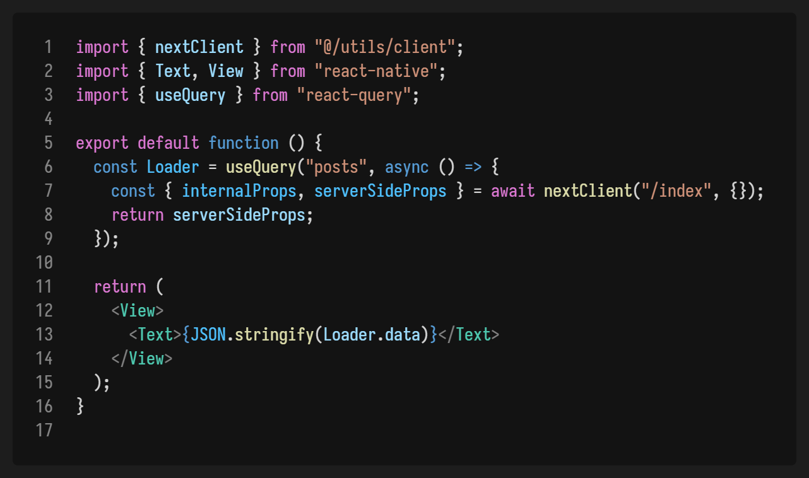
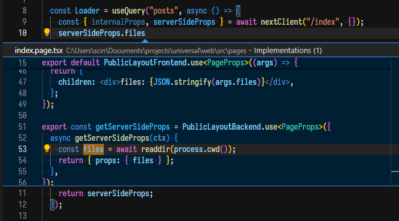

### Universal

A React Native and [@scinorandex/ssr](https://github.com/scinscinscin/ssr) template maximizing code-reuse.

The idea is to reuse the same data-fetching logic for Next.js and React Native. This entails in getting the props that `getServerSideProps` returns in the pages and instead of rendering the page, returning the props as JSON.

This means that the Next.js page file can return both HTML and JSON, determined by the value of the `Accept` HTTP header, returning props if it's equal to `application/json` and the HTML if not.

The props returned from `getServerSideProps` are intercepted and returned as JSON, before Next.js renders it as as HTML. There is nothing insecure here, as the data would have been available as `window.__NEXT_DATA__` anyways.

### Example

In this example, React Query is fetching the props from the Next.js frontend, specifically hitting the `getServerSideProps` export in `/web/src/pages/index.page.tsx`. 

`nextClient()` is fully typesafe. Any path parameters (required / catchall / optional catch-all) need to be specified in the second argument, and its return type is the same as what the page returns.

You can even find out where it's implemented and defined using the language server.

